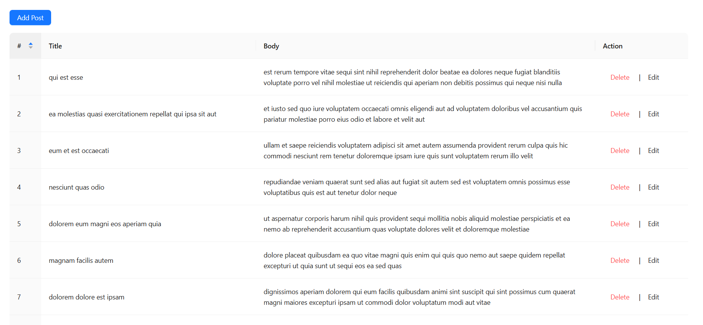
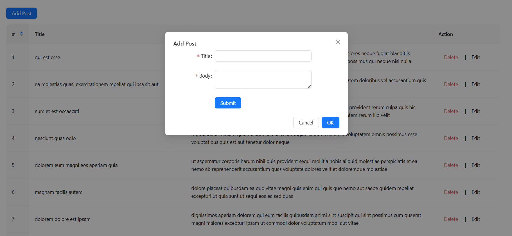
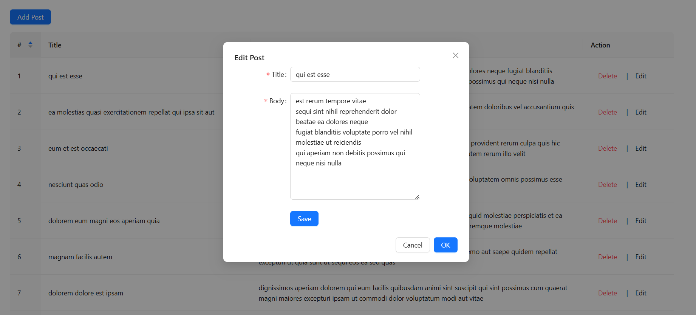
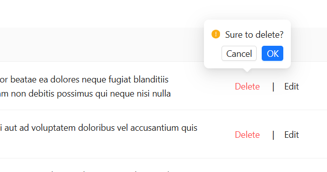

This is a [Next.js](https://nextjs.org) project bootstrapped with [`create-next-app`](https://nextjs.org/docs/app/api-reference/cli/create-next-app).

## Getting Started

First, run the development server:

```bash
npm install
npm run dev
```

Open [http://localhost:3000](http://localhost:3000) with your browser to see the result.
##### not in edit post :
when edit new added post row in table , will not give the old  data beacuse i get post old data from api via  since jsonplaceholder not edit data of api , added or deleted or edit  
##### challenges faced :
   This is my first time using Ant design, and it gave me a run time error because it is not compatible with the latest version of ReactJS (v19).
##### Approximate time spent on the assignment :
   9h 
 
### screenshot from project 
##### Posts table

##### Add post 

##### Edit post 

##### Delete post

